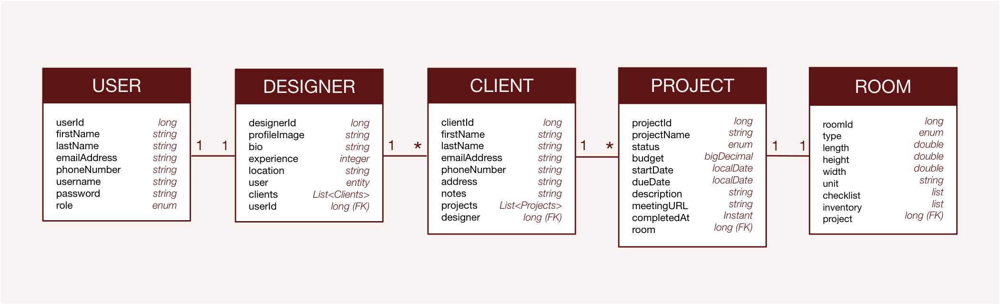

# Interior Design Planner API 🏚️🏠

A lightweight RESTful API that helps **interior designers** organise projects from planning to completion for their clients. The API allows designers to track clients details, projects, tasks, timelines and room specifications.

---

## 💡 Live Application

- API Documentation: https://interior-design-planner.up.railway.app/swagger-ui/index.html
- Health Check: https://interior-design-planner.up.railway.app/actuator/health

---

## 📝 Features

- **Client Management** - CRUD operations for client details.
- **Project Management** - manage projects with a budget, deadlines, status and meeting links.
- **Room Management** - define rooms with dimensions, room type and design changes and checklists.
- **Status Tracking** - track project stages using enums i.e PLANNING, COMPLETED, ARCHIVED...
- **Audit Logging** - automatically records dates created and updated timestamps.
- **Spring Security** - JWT authentication and authorisation.
- **Role Based Access Control** - ADMIN and Designer roles.
- **Pagination and Filtering** - paginated endpoints with RSQL Support.

---

## 🗺️ Architecture



---

### Entity Relationships

- **User** -> one to one -> **Designer** (one user can have one designer)
- **Designer** -> one to many -> **Client** (one designer can have many clients)
- **Client** -> one to many -> **Projects** (one client can have many projects)
- **Project** -> one to one -> **Room** (one project can have one room)

---

## 🛠️ Tech Stack

**Languages**: 

**Frameworks**:  

**Build Tool**: 

**Database**: 

**Testing**:  

**Version Control**:  

**Containerisation**: 

**API Testing**: 

---

## 📦 Libraries

- [RSQL-JPA](https://github.com/perplexhub/rsql-jpa-specification) - RSQL filtering support for JPA repositories

---

## 🧱 Prerequisites

1. Install [Java 17+](https://www.java.com/en/)
2. Install [Maven](https://maven.apache.org/) with your IDE
3. Use an IDE - [Visual Studio Code](https://code.visualstudio.com/) or [IntelliJ IDEA](https://www.jetbrains.com/idea/download/)
4. Install [Docker](https://www.docker.com/products/docker-desktop/)
5. Install [Git](https://git-scm.com/)
6. Install [Postman](https://www.postman.com/) to test REST API endpoints

---

## 👷🏿‍♀️ Getting Started

### Clone the repository

```
 git clone https://github.com/Vicko657/interior-design-planner-api.git
 cd interior-design-planner-api
```

### Configure environment variables:

- Create a `.env` file in the project root, see `.env.example` for required variables.
- Create a `local.properties` file in `src/main/resources`, see `local.properties.example` for required variables.

### Start MySQL with Docker

```
docker-compose up -d
```

### Build and run:

```
./mvnw clean install
./mvnw spring-boot:run
```

---

## 🔐 Security

- JWT token based authentication
- Role based access control

| Role     | Access                                          |
| -------- | ----------------------------------------------- |
| Admin    | Full access to all endpoints                    |
| Designer | Access to their own clients, projects and rooms |

---

## 📏 📐 Testing

```
./mvnw clean test
```

Test coverage includes:

- Unit tests for service layer
- Repository tests
- Integration tests for controller layer

---

## 🏘️ API Endpoints

Here are some examples of the endpoints used in the API:

### 🔑 Authentication (Public)

| Method | Endpoint           | Description                            |
| ------ | ------------------ | -------------------------------------- |
| POST   | /api/auth/register | Register new user                      |
| POST   | /api/auth/login    | Created, resource created successfully |

### 💁🏾‍♀️ Clients

<hr>

| Method | Endpoint     | Description                        |
| ------ | ------------ | ---------------------------------- |
| POST   | /api/clients | Creates a new client on the system |
| GET    | /api/clients | Returns the designer's clients     |

### 🗂️ Projects

<hr>

| Method | Endpoint                      | Description                                |
| ------ | ----------------------------- | ------------------------------------------ |
| GET    | /api/projects/status/{status} | Returns projects with the specified status |
| GET    | /api/projects/deadlines       | Returns projects ordered by dueDate        |

### 🛌 Rooms

<hr>

| Method | Endpoint                                 | Description                             |
| ------ | ---------------------------------------- | --------------------------------------- |
| GET    | /api/rooms/type/{type}                   | Returns rooms with the specified type   |
| PATCH  | /api/rooms/{roomId}/projects/{projectId} | Reassigns a room to a different project |

---

## 🔍 RSQL Filtering (ADMIN only)

The API supports RSQL filtering for advanced admin queries:

```
GET /api/admin/clients?filter=firstName==Johnson
GET /api/admin/projects?filter=ACTIVE
GET /api/admin/rooms?filter=type==LIVING_ROOM;width=gt=3.0
```

- RSQL filtering is restricted to ADMIN role only
- DESIGNER role has access to standard endpoints only;

---

## ⚠️ Error Handling

| Status Code | Description                              |
| ----------- | ---------------------------------------- |
| 200         | OK - request successful                  |
| 201         | Created - resource created successfully  |
| 400         | Bad Request - invalid input              |
| 401         | Unauthorized - invalid or missing token  |
| 403         | Forbidden - insufficient permissions     |
| 404         | Not Found - resources not found          |
| 500         | Internal Server Error - unexpected error |

Custom exceptions are thrown for each entity (e.g `ClientNotFoundException` with descriptive error messages).

---

## 🖥️ Frontend

The frontend for this application is available at:
[Interior Design Planner Frontend](https://github.com/Vicko657/interior-design-planner-app)

`Live application:`
https://viewinterior.netlify.app
